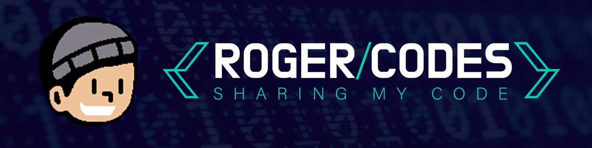

<h1 align="left">Hi, I'm Rogelio Herrera 👋</h1>

###

<h3 align="left">Fullstack Web Developer</h3>

###

<h2 align="left">About</h2>

###

I'm not a robot 🤖, I'm Rogelio but everyone calls me Roger.

###

My passion is building functional, beautiful, user friendly websites and applications 🖥️.

###

I also run an <a href="https://rogercodes.blog" target="_blank">online blog</a>, as well as a <a href="https://youtube.com/@rogercodes" target="_blank">youtube channel</a> where i share all things related to programming and IT.

###

<h2 align="left">You can find me here</h2>

###

 

 

 

 

###

<h2 align="left">I code with</h2>

###

  
  
  
  
  
  
  
  
  
  
  
  
  
  
  
  
  
  
  
  
  
  
  

###

<h2 align="left">I use for fun</h2>

###

  
  
  
  
  
  
  

###
